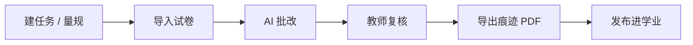

<div align="center">


# 教育参谋

**给班主任的本地桌面助手**

操行分 · 谈心计划 · 周报 · 家校话术 · 学业分析 · **AI 批改作业**

数据在你电脑上，模型你自己选。

<br>

[MIT 许可证](./LICENSE)
&nbsp;·&nbsp;
[行为准则](./CODE_OF_CONDUCT.md)
&nbsp;·&nbsp;
[贡献指南](./CONTRIBUTING.md)
&nbsp;·&nbsp;
[安全政策](./SECURITY.md)

[](./LICENSE)
[](./CODE_OF_CONDUCT.md)
[](./CONTRIBUTING.md)
[](./SECURITY.md)

<sub>Education Advisor · 跨平台桌面应用 · Electron + React + TypeScript + Rust</sub>

</div>

---

<table>
<tr>
<td width="25%" align="center"><strong>18 个角色</strong><br><sub>班务、学业、家校、治理各司其职</sub></td>
<td width="25%" align="center"><strong>30+ 模型</strong><br><sub>云端或本地，目录跟 Pi 走</sub></td>
<td width="25%" align="center"><strong>本机数据</strong><br><sub>Rust 事件库，可审计、可换模型</sub></td>
<td width="25%" align="center"><strong>隐私默认开</strong><br><sub>出域前 AES-256-GCM 脱敏</sub></td>
</tr>
</table>

面向国内初高中班主任。不是聊天机器人，也不是把成绩传到云端的 SaaS：学生数据落在本机，大模型只看到脱敏后的切片。3–4B 小模型也能跑——数字必须来自工具，写操作必须确认。

---

## 能做什么

<table>
<tr>
<td width="50%" valign="top">

**日常班务**  
加分扣分、操行排名、风险预警、周报草稿。

**学业**  
考试录入、学科对比、学生档案、报告中心。

</td>
<td width="50%" valign="top">

**批改作业**  
拍照 / 扫描 → AI 按量规给分 → 教师复核 → 发布进学业分析。

**家校与隐私**  
家长话术草稿、可选飞书同步；姓名身份证出域前化名。

</td>
</tr>
</table>

---

## 批改作业

侧边栏一级入口 **「批改作业」**。整条链路在本机完成，卷面不出校。



| 步骤 | 说明 |
| --- | --- |
| 建任务 | 学期、班级、科目；量规可手填，也可拍 1～8 张样卷自动抽题 |
| 导入试卷 | jpg / png / webp / bmp；同名多页合成一份；**不用改文件名**，读首页姓名对花名册 |
| AI 批改 | 按量规逐份串行，可中止、可重试；需配置支持看图的「批改模型」 |
| 复核 | 左原图、右逐题得分；教师改分优先于 AI |
| 导出痕迹 | 原卷叠红框批注、得分和评语，可打印或另存 PDF |
| 发布成绩 | 写入学业管线，考试分析 / 学生档案 / 报告中心立刻可见 |

量规与批改链路参照 [Submitty](https://github.com/Submitty/Submitty)。完整说明：[批改作业文档](./docs/features/GRADING.md)。

---

## 界面

仪表盘 · 对话 · 学生 · 班级 · 学业 · **批改作业** · Agent · 模型 · 技能 · 任务 · 报告中心 · 隐私 · 设置

导入花名册用 **班级 / 学生**（Excel 一次导入，不要把身份证贴进对话）。批改模型在 **设置 → 模型**。

---

## 为什么是本地

- **数据在你手里** — Rust 事件库只追加、可审计；换 GPT / DeepSeek / Ollama，班级账本不用搬。
- **十八个工种，不是一个人格** — 班务只记分，校验员对账，心理观察员只标不写、不下诊断。
- **小模型规则** — 数字来自工具，写入先确认。[规则全文](./config/SMALL_MODEL_RULES.md)。
- **隐私默认打开** — 出域前化名，家长信可按收件人过滤。[安全政策](./SECURITY.md)。

---

## 快速开始

需要 **Node.js ≥ 22**，以及能编译原生模块的 C++ 工具链。排错见 [快速上手](./docs/QUICK_START.md)。

```bash
git clone https://github.com/232252/education-advisor.git
cd education-advisor
npm ci
npm run build:eaa      # 编译本仓库 core/eaa-cli 的 Rust 引擎
npm run dev            # 另开终端再跑 npm run dev:electron
```

打开应用后：选语言和主题 → 填 API Key（批改还要选视觉模型）→ 导入花名册。隐私引擎、飞书、本机 WebUI 都是可选；WebUI 默认关，开了也是 HTTPS + 令牌。

```bash
npm run build
npm run package            # Windows 安装包
npm run package:portable   # 绿色版 exe
```

---

## 18 个角色

每个角色是一对 Markdown（`SOUL.md` + `AGENTS.md`），权限写在 [`config/agents.yaml`](./config/agents.yaml)。新写一个角色看 [Agent 编写指南](./docs/AGENT_AUTHORING.md)。

| 线 | 角色 | 做什么 |
| --- | --- | --- |
| 班务 | 教育参谋、班务助理、周报、预警、关怀 | 查分记分、周报草稿、只加分找亮点 |
| 学业 | 学业规划、学业分析、数据分析、科研 | 谈话计划、成绩趋势、描述统计 |
| 家校 | 家校沟通、心理观察 | 给家长的草稿；只报行为模式，不下诊断 |
| 治理 | 督导、纪律、安全、质检、巡检、质量守门 | 校验复盘、违纪复查、异常只报告不擅改 |

---

## 文档

[项目长文](./PROJECT_INTRO.md)
· [快速上手](./docs/QUICK_START.md)
· [批改作业](./docs/features/GRADING.md)
· [架构](./docs/ARCHITECTURE.md)
· [配置](./docs/CONFIGURATION.md)
· [隐私引擎](./docs/PRIVACY_ENGINE.md)
· [FAQ](./docs/FAQ.md)
· [路线图](./ROADMAP.md)

---

## 开源

本仓库遵循 GitHub 社区标准。

- **[行为准则](./CODE_OF_CONDUCT.md)** — Contributor Covenant 2.1。禁止在 Issue / PR 贴真实学生数据
- **[贡献指南](./CONTRIBUTING.md)** — 开发环境、提交规范、如何加 Agent
- **[MIT 许可证](./LICENSE)** — 可商用、可分叉，保留版权声明即可
- **[安全政策](./SECURITY.md)** — 漏洞请私下报告，不要开公开 Issue

```bash
npm run typecheck && npm run lint && npm run test
```

[MIT License](./LICENSE) © 2026 Education Advisor AI Contributors。

感谢 [earendil-works/pi](https://github.com/earendil-works/pi)、[Submitty](https://github.com/Submitty/Submitty)，以及每一位把操行本改到深夜的老师。
