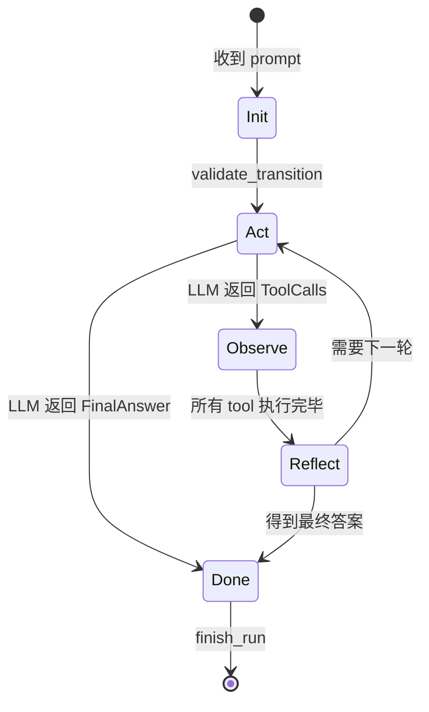
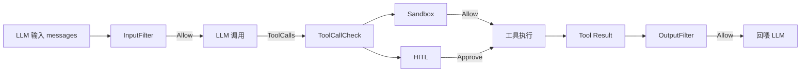
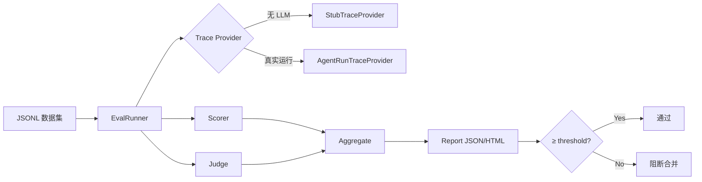
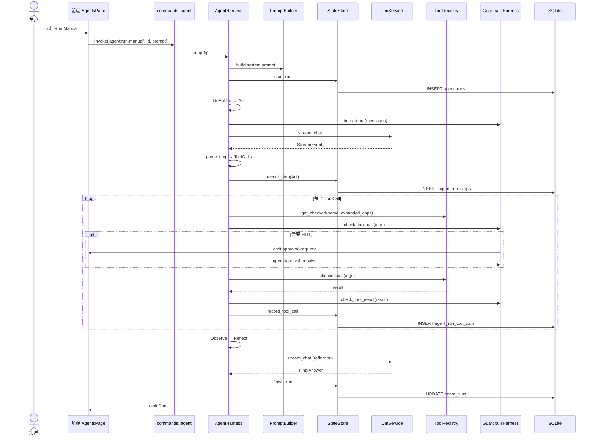

# Education Advisor — AI Harness 三层架构

> 本文档定义 Education Advisor 中 AI 能力的 Harness 化架构：Agent Harness（执行层）、Guardrails Harness（护栏层）、Evaluation Harness（评估层）。

---

## 1. 设计原则

1. **状态外化**：Agent 运行中的对话状态、任务进度、工具调用结果从 LLM 上下文窗口剥离，持久化到 SQLite，支持跨步骤恢复与审计。
2. **分层解耦**：LLM Service 保持协议纯净；Harness 负责编排；Guardrails 负责安全；Evaluation 负责度量。
3. **最小权限**：每个 Agent 通过 YAML 配置 capabilities，ToolRegistry 精确校验；高危操作由 HITL 二次审批。
4. **可评估**：任何 Prompt、模型、代码变更都必须通过结构化评测数据集，低于阈值阻断合并。

---

## 2. 三层 Harness 总览

```mermaid
flowchart TB
    subgraph Frontend["前端 (React 18)"]
        ChatPage["ChatPage"]
        AgentsPage["AgentsPage"]
        ApprovalDialog["HITL 审批弹窗"]
        MemoryPanel["记忆管理面板"]
    end

    subgraph Tauri["Tauri 2.0 主进程 (Rust)"]
        subgraph AgentHarness["Agent Harness — 执行层"]
            AgentService["AgentService\n加载 SOUL/Rules/caps"]
            PromptBuilder["PromptBuilder\nSystem Prompt + Skill + Tool 描述"]
            StateStore["StateStore\nagent_runs / steps / tool_calls"]
            ReActMachine["ReActMachine\nPlan → Act → Observe → Reflect → Done"]
            ToolRegistry["ToolRegistry\nget_checked + capability 展开"]
            EventBridge["EventBridge\nemit 状态事件"]
        end

        subgraph GuardrailsHarness["Guardrails Harness — 护栏层"]
            InputFilter["InputFilter\n注入 / PII / 密钥检测"]
            Sandbox["Sandbox\n路径 / 大小 / 超时"]
            HITL["HITL\n人类审批队列"]
            OutputFilter["OutputFilter\nSchema / 截断 / PII 反脱敏"]
        end

        subgraph EvaluationHarness["Evaluation Harness — 评估层"]
            Dataset["Dataset\nJSONL 评测用例"]
            EvalRunner["EvalRunner\nStubTrace / AgentTrace"]
            Scorer["Scorer\n工具匹配 / PII / 预算 / Schema"]
            Judge["Judge\nStub / LLM-as-a-Judge"]
            Report["Report\nJSON + HTML 报告"]
        end

        LlmService["LlmService\n30+ Provider SSE"]
        EaaCore["eaa_core\n事件溯源数据引擎"]
        Db[(SQLite)]
        PrivacyEngine["PrivacyEngine\nAES-256-GCM"]
        SkillService["SkillService\nMarkdown Skill"]
    end

    subgraph Providers["LLM Providers"]
        OpenAI["OpenAI / DeepSeek / Qwen / ..."]
        Anthropic["Anthropic"]
        Gemini["Google Gemini"]
    end

    ChatPage -->|ai:chat| LlmService
    AgentsPage -->|agent:run-manual| AgentHarness
    AgentHarness -->|stream_chat| LlmService
    LlmService -->|SSE| Providers

    AgentHarness -->|加载| AgentService
    AgentHarness -->|构建 prompt| PromptBuilder
    AgentHarness -->|持久化| StateStore
    StateStore --> Db
    AgentHarness -->|ReAct 循环| ReActMachine
    AgentHarness -->| capability 展开| ToolRegistry
    AgentHarness -->|emit| EventBridge
    EventBridge --> Frontend

    ToolRegistry -->|EAA 工具| EaaCore
    ToolRegistry -->|文件/计算| file_tools["file_tools / utility"]

    AgentHarness -->|check_input| InputFilter
    AgentHarness -->|check_tool_call| Sandbox
    AgentHarness -->|check_tool_call| HITL
    AgentHarness -->|check_tool_result| OutputFilter
    InputFilter --> PrivacyEngine
    OutputFilter --> PrivacyEngine
    HITL -->|approval-required| ApprovalDialog
    ApprovalDialog -->|agent:approval_resolve| HITL

    SkillService -->|注入| PromptBuilder
    SkillService -->|注册工具| ToolRegistry

    EvaluationHarness -->|加载| Dataset
    EvalRunner -->|trace| AgentHarness
    EvalRunner -->|score| Scorer
    EvalRunner -->|judge| Judge
    EvalRunner -->|write| Report
    Judge -->|可选| LlmService
```



---

## 3. Agent Harness（执行层）

### 3.1 职责

- 加载 Agent 配置（`config/agents.yaml` + `SOUL.md` + `AGENTS.md`）。
- 解析模型 tier，选择 provider/model，获取 API key。
- 构建 System Prompt（SOUL + Rules + Skills + Tool 描述 + 动态上下文）。
- 驱动 ReAct 状态机循环。
- 调用 ToolRegistry 执行工具，持久化步骤与工具调用到 `StateStore`。
- 通过 `EventBridge` 向前端推送运行状态。

### 3.2 ReAct 状态变迁



### 3.3 关键类型

| 类型 | 文件 | 说明 |
|------|------|------|
| `AgentHarness` | `harness/agent/mod.rs` | 执行入口。 |
| `AgentRunConfig` | `harness/agent/mod.rs` | 单次运行配置。 |
| `ReActMachine` | `harness/agent/react_machine.rs` | 状态转换与 LLM 输出解析。 |
| `StateStore` | `harness/agent/state_store.rs` | 状态外化持久化。 |
| `PromptBuilder` | `harness/agent/prompt_builder.rs` | Prompt 组装。 |
| `BudgetTracker` | `harness/agent/budget.rs` | 成本/轮数/时间预算。 |
| `EventBridge` | `harness/agent/event_bridge.rs` | 事件 emit。 |

---

## 4. Guardrails Harness（护栏层）

### 4.1 职责

在 Agent Harness 的三个关键钩子点实施安全策略：

1. **LLM 输入前**：`check_input` — 防止 prompt 注入、过度 PII、密钥泄露。
2. **工具调用前**：`check_tool_call` — 沙箱校验、大小限制、HITL 审批。
3. **工具结果后**：`check_tool_result` — Schema 校验、大小截断、PII 反脱敏检测。

### 4.2 守卫链 Pipeline



### 4.3 关键类型

| 类型 | 文件 | 说明 |
|------|------|------|
| `GuardrailPipeline` | `harness/guardrails/mod.rs` | 守卫链 orchestrator。 |
| `InputFilter` | `harness/guardrails/input_filter.rs` | 输入过滤。 |
| `OutputFilter` | `harness/guardrails/output_filter.rs` | 输出过滤。 |
| `ApprovalChannel` | `harness/guardrails/hitl.rs` | HITL 审批总线。 |
| `Sandbox` | `harness/guardrails/sandbox.rs` | 资源限制。 |

---

## 5. Evaluation Harness（评估层）

### 5.1 职责

- 加载结构化评测数据集（JSONL）。
- 用 `StubTraceProvider`（无需真实 LLM）或 `AgentRunTraceProvider`（真实运行）生成 trace。
- `Scorer` 量化工具调用正确性、PII 泄露、预算遵守、Schema 合规。
- `Judge` 对开放性生成评分（Stub / LLM-as-a-Judge）。
- `Report` 输出 JSON/HTML 报告与是否通过阈值。

### 5.2 评估流水线



### 5.3 关键类型

| 类型 | 文件 | 说明 |
|------|------|------|
| `Dataset` / `Case` | `harness/eval/dataset.rs` | 数据集加载。 |
| `EvalRunner` | `harness/eval/runner.rs` | 评估执行。 |
| `Scorer` | `harness/eval/scorer.rs` | 客观评分。 |
| `Judge` / `LlmJudgeClient` | `harness/eval/judge.rs` | 裁判模型。 |
| `ReportWriter` | `harness/eval/report.rs` | 报告生成。 |

---

## 6. 数据流：从用户点击到 AI 响应



---

## 7. 深度融合设计

### 7.1 上下文感知 Prompt

前端在调用 `agent:run-manual` 时传入 `context`：

```json
{
  "currentPage": "/students",
  "selectedStudent": "张三",
  "openSettings": null
}
```

`PromptBuilder` 把这些动态上下文追加到 System Prompt 的 `[应用上下文]` 段。

### 7.2 Skill 系统

Skill 从“纯文本 prompt 注入”升级为“可注册工具”：

- Skill frontmatter 增加 `tools` 字段：
  ```yaml
  ---
  name: 周报技能
  tools:
    - name: generate_weekly_report
      description: 生成班级周报
      schema: {...}
  ---
  ```
- `SkillService` 解析后向 `ToolRegistry` 注册工具。
- AgentHarness 构建 registry 时合并启用的 skill tools。

### 7.3 跨会话记忆

新增 `agent_memory` 表：

| 字段 | 说明 |
|------|------|
| id | UUID |
| agent_id | 所属 agent |
| kind | fact / preference / summary |
| content_json | 记忆内容 |
| created_at | 创建时间 |
| last_accessed_at | 最后访问 |

- AgentHarness 启动时读取最近 N 条记忆注入 prompt。
- FinalAnswer 生成后，用轻量 prompt 抽取关键事实写回记忆。
- 前端 `MemoryPanel` 可查看/删除记忆。

---

## 8. 与原始 Electron 主进程的对比

| 维度 | 旧 Electron (v0.1.x) | 新 Tauri + Harness (v0.2.0) |
|------|----------------------|----------------------------|
| 运行时 | Node 22 + Electron 33 | Rust + Tauri 2.0 |
| AI 调用 | `pi-ai` SDK | `llm_service.rs` + SSE |
| 工具调用 | 单文件大函数 | `ToolRegistry` + trait |
| 状态 | 内存 + SQLite | `StateStore` 外化 + SQLite |
| 安全 | 基础校验 | `GuardrailsPipeline` |
| 评估 | 无 | `EvaluationHarness` |
| 记忆 | 无 | `agent_memory` |

---

## 9. 文件索引

| 路径 | 说明 |
|------|------|
| `src-tauri/src/harness/agent/` | Agent Harness 执行层。 |
| `src-tauri/src/harness/guardrails/` | Guardrails Harness 护栏层。 |
| `src-tauri/src/harness/eval/` | Evaluation Harness 评估层。 |
| `src-tauri/src/harness/tools/` | ToolRegistry、capability 展开、eaa_bridge。 |
| `src-tauri/src/services/llm_service.rs` | LLM 服务。 |
| `src-tauri/src/services/agent_runner.rs` | Agent 执行入口。 |
| `src-tauri/src/services/skill_service.rs` | Skill 管理。 |
| `src-tauri/src/services/db.rs` | SQLite schema 与迁移。 |
| `src-tauri/eval/datasets/` | 评测数据集。 |
| `config/agents.yaml` | Agent 注册表。 |
