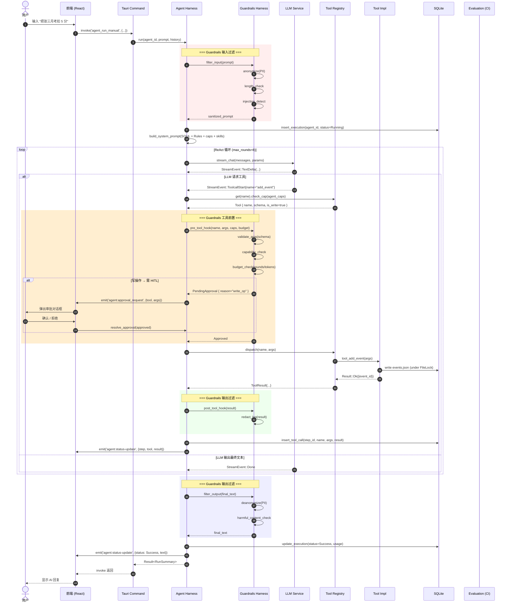
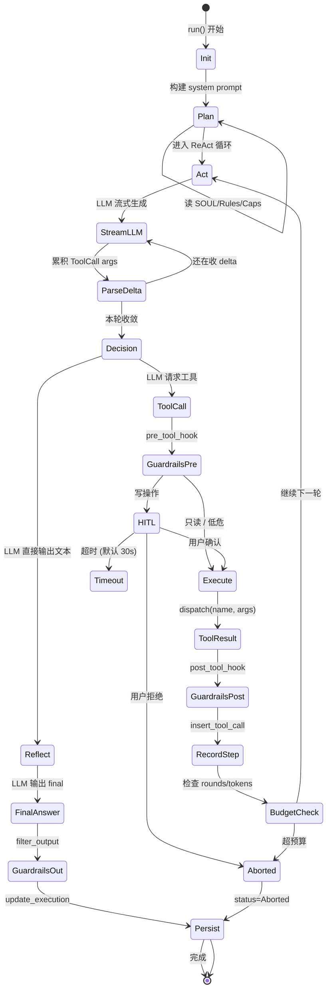
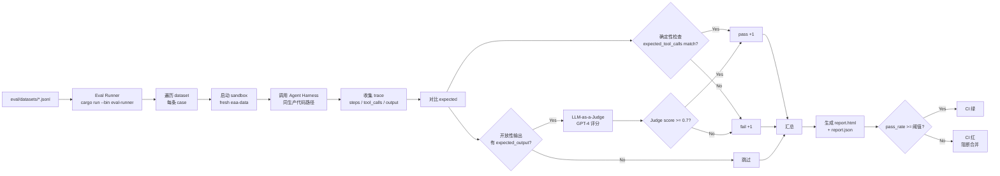

# 阶段一·架构蓝图 - Education Advisor 三层 AI Harness

> 设计日期: 2026-06-16
> 设计依据: `02-inventory.md` 实测现状
> 设计目标: 把"独立的 LLM 调用"重构为"深度嵌入应用流程、可被持续评估和优化的原生组件"

## 1. 三层 Harness 概览

```
┌────────────────────────────────────────────────────────────────────────┐
│                                                                        │
│                         应用前端 (React + Tauri WebView)                │
│                                                                        │
│   ┌──────────────┐  ┌──────────────┐  ┌──────────────┐                │
│   │ AI Chat Panel│  │ Agent Runner │  │ Skill Browser│                │
│   │  (人机对话)  │  │  UI (执行面板)│  │  (技能管理)  │                │
│   └──────┬───────┘  └──────┬───────┘  └──────┬───────┘                │
│          │                 │                 │                        │
└──────────┼─────────────────┼─────────────────┼────────────────────────┘
           │   Tauri invoke │                 │
           │  + emit stream │
┌──────────▼─────────────────▼─────────────────▼────────────────────────┐
│                                                                        │
│                            Tauri 命令层                                │
│                                                                        │
│   commands/ai.rs    commands/agent.rs    commands/chat.rs              │
│                                                                        │
└──────────┬─────────────────┬─────────────────┬────────────────────────┘
           │                 │                 │
           ▼                 ▼                 ▼
┌────────────────────────────────────────────────────────────────────────┐
│                                                                        │
│   ┌───────────────────────────────────────────────────────────────┐   │
│   │                                                               │   │
│   │                  ✦ AGENT HARNESS (执行层) ✦                  │   │
│   │                                                               │   │
│   │   ┌──────────┐  ┌──────────┐  ┌──────────┐  ┌──────────┐     │   │
│   │   │  State   │  │   Plan   │  │  Tool    │  │  Event   │     │   │
│   │   │  Store   │◄─┤ Executor ├─►│ Registry │◄─┤  Bridge  │     │   │
│   │   └──────────┘  └────┬─────┘  └────┬─────┘  └──────────┘     │   │
│   │         ▲            │             │                          │   │
│   │         │            ▼             │                          │   │
│   │   ┌─────┴─────┐ ┌──────────┐      │                          │   │
│   │   │   ReAct   │ │  Budget  │      │                          │   │
│   │   │  State    │ │  Tracker │      │                          │   │
│   │   │  Machine  │ └──────────┘      │                          │   │
│   │   └───────────┘                   │                          │   │
│   │                                   │                          │   │
│   └───────────────────────────────────┼──────────────────────────┘   │
│                                       │                              │
│                                       ▼                              │
│   ┌───────────────────────────────────────────────────────────────┐   │
│   │                                                               │   │
│   │                ✦ GUARDRAILS HARNESS (护栏层) ✦               │   │
│   │                                                               │   │
│   │   ┌──────────┐  ┌──────────┐  ┌──────────┐  ┌──────────┐     │   │
│   │   │  Input   │  │  Output  │  │ Approval │  │  Sandbox │     │   │
│   │   │ Filter   │  │ Filter   │  │  (HITL)  │  │  (资源)  │     │   │
│   │   └──────────┘  └──────────┘  └──────────┘  └──────────┘     │   │
│   │         ▲            ▲             ▲            ▲            │   │
│   │         │            │             │            │            │   │
│   │   ┌─────┴────────────┴─────────────┴────────────┴────┐       │   │
│   │   │          Guardrails 中间件链 (洋葱模型)           │       │   │
│   │   │  redact → validate → cap_check → budget_check   │       │   │
│   │   └──────────────────────────────────────────────────┘       │   │
│   │                                                               │   │
│   └───────────────────────────────────────────────────────────────┘   │
│                                       │                              │
│                                       ▼                              │
│   ┌───────────────────────────────────────────────────────────────┐   │
│   │                                                               │   │
│   │              ✦ EVALUATION HARNESS (评估层) ✦                 │   │
│   │                                                               │   │
│   │   ┌──────────┐  ┌──────────┐  ┌──────────┐  ┌──────────┐     │   │
│   │   │ Dataset  │  │  Runner  │  │  Judge   │  │  Report  │     │   │
│   │   │ (JSONL)  │  │  (CI)    │  │(LLM-as-J)│  │  (HTML)  │     │   │
│   │   └──────────┘  └──────────┘  └──────────┘  └──────────┘     │   │
│   │                                                               │   │
│   └───────────────────────────────────────────────────────────────┘   │
│                                                                        │
└──────────┬─────────────────────────────────────────────────────────────┘
           │
           ▼
┌────────────────────────────────────────────────────────────────────────┐
│                         LLM Provider 层 (现有)                         │
│   OpenAI / Anthropic / Gemini / DeepSeek / Moonshot / Zhipu / 兼容协议 │
└────────────────────────────────────────────────────────────────────────┘
```

## 2. 三层职责划分

### Agent Harness (执行层) — 核心是"ReAct 状态机 + 工具调用编排"

**职责**:
- **状态外化**: 把 agent 运行时的 messages / tool_calls / 步骤进度从易失上下文剥离, 持久化到 SQLite (`agent_runs` / `agent_steps` / `agent_tool_calls` 三表)
- **任务编排**: 显式 ReAct 状态机 (Plan → Act → Observe → Reflect), 支持步骤依赖、并行工具、超时取消
- **工具调用**: 统一 `trait Tool` + `ToolRegistry`, 30 个 eaa_tools 改为 30 个 impl
- **流式推送**: EventBridge 把 StreamEvent + ReAct 状态变更 emit 给前端

**绝不负责** (职责边界):
- ❌ 不做 PII 检测 / 脱敏 (那是 Guardrails 的)
- ❌ 不做评分 / 评测 (那是 Evaluation 的)
- ❌ 不直接调 LLM Provider (它通过 LLM Service 的"单步 stream_chat"接口)

### Guardrails Harness (护栏层) — 核心是"洋葱模型中间件链"

**职责**:
- **输入过滤**: 用户 prompt 进 LLM 前, 脱敏 PII / 检测恶意指令 / 限长
- **输出过滤**: LLM 流式文本回来后, 还原脱敏 / 检测有害内容 / 拦截越权指令
- **工具调用前置钩子**: 参数校验 (data-validation) + capability 检查 (least-privilege) + 预算检查 (max_rounds/max_tokens)
- **Human-in-the-Loop**: 写操作 (add_event / delete_student / write_file) 冻结等用户确认
- **沙箱**: 工具执行的资源限制 (CPU/内存/时间), 通过 OS 进程隔离

**绝不负责**:
- ❌ 不编排任务 (那是 Agent 的)
- ❌ 不评分 (那是 Evaluation 的)
- ❌ 业务逻辑不参与, 只做"在 / 不在 / 改 / 等"

### Evaluation Harness (评估层) — 核心是"可重复执行的回归测试"

**职责**:
- **业务级评测集**: `eval/datasets/*.jsonl`, 每条包含 `input` / `expected_tool_calls` / `expected_output`
- **CI 集成**: GitHub Actions 工作流, 跑 eval, 得分低于阈值阻断合并
- **LLM-as-a-Judge**: 用 GPT-4 给开放性生成打分, 输出结构化理由 (reasoning + score + pass/fail)
- **退化捕获**: 对比两个 commit 的 eval 报告, 自动标注回归项

**绝不负责**:
- ❌ 不参与运行时 (eval 是离线 CI 跑, 不进生产代码)
- ❌ 不改业务逻辑 (只读 + 评分)

## 3. 完整数据流 (Mermaid)

### 3.1 运行时数据流: 用户操作 → AI 响应



### 3.2 状态机: ReAct 循环



### 3.3 评估流 (CI 离线)



## 4. 关键边界约束 (防越界)

| 层 | 可以调用 | 严禁调用 |
|:---|:---------|:---------|
| **Agent Harness** | LLM Service (单步 stream_chat)、Tool Registry、Guardrails 中间件、State Store、DB | LLM Provider 直接 API、Tool impl 直接函数 (必须经 Registry) |
| **Guardrails Harness** | PrivacyEngine、keystore (读 API key 元数据)、data-validation crate、OS 进程 API (沙箱) | 业务逻辑 (例如 add_event 的 reason_code 白名单)、Tool Registry 之外的工具 |
| **Evaluation Harness** | Agent Harness 公共 API (同生产路径)、LLM Provider (Judge 用) | 写业务数据 (只读 sandbox)、修改 prod DB |

## 5. 阶段二作战计划 (预览)

基于蓝图, 阶段二要做:

### 新增文件
- `src-tauri/src/harness/mod.rs` — Harness 模块根
- `src-tauri/src/harness/agent/mod.rs` — Agent Harness 主入口
- `src-tauri/src/harness/agent/state_store.rs` — 状态外化
- `src-tauri/src/harness/agent/react_machine.rs` — ReAct 状态机
- `src-tauri/src/harness/tools/mod.rs` — Tool trait + Registry
- `src-tauri/src/harness/tools/registry.rs`
- `src-tauri/src/harness/event_bridge.rs`
- `src-tauri/src/harness/error.rs`

### 修改文件
- `services/llm_service.rs` — **删除** `stream_chat_with_tool_loop`, 只保留单步 `stream_chat`
- `services/agent_runner.rs` — **瘦身为 ~80 行**, 调 `AgentHarness::run()`
- `tools/eaa_tools.rs` — **30 个 tool_xxx 改为 30 个 impl Tool**
- `tools/file_tools.rs`, `tools/utility.rs` — 同上
- `state.rs` — 加 `harness: Arc<AgentHarness>`

### 评估指标
- `agent_runner.rs` 从 290 行降到 ≤ 80 行
- `eaa_tools.rs` 不再有顶层 `match` (30 行分发 → 0)
- 新增集成测试: `tests/harness_react_loop.rs`, 跑通一个 add_event 用例

## 6. 风险与回退策略

| 风险 | 影响 | 回退策略 |
|:-----|:-----|:---------|
| 工具循环上移到 Harness 后, 性能下降 | LLM 单步调用 overhead | 保留 `stream_chat` 内部 mini-loop 路径, Harness 通过 `optimization_hint` 启用 |
| Tool trait 引入破坏现有 30 个工具 | 编译失败 | 一次性迁移 + 集成测试覆盖, commit 颗粒度小 |
| 状态外化增加 IO | agent 启动变慢 | L0 内存态保留, 只在 step 边界落 DB |

---

**下一步**: 阶段二实施 (用户批准后开始)